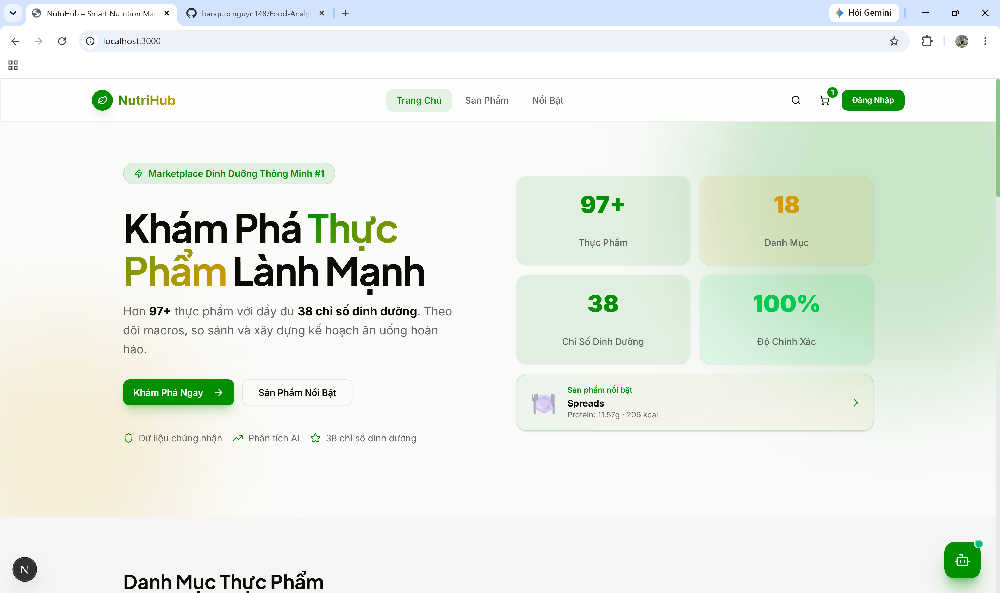
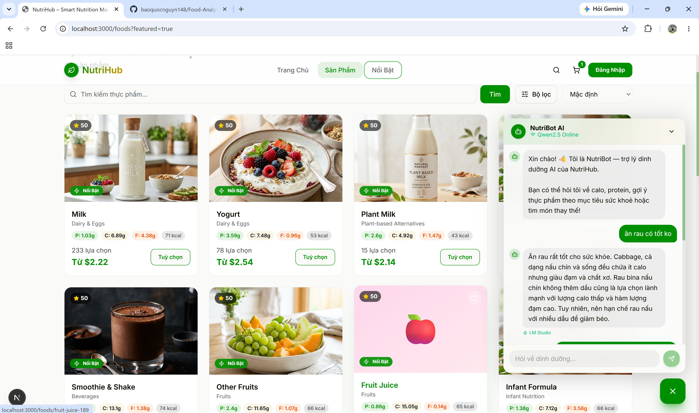

# 📊 Food Analytics End-to-End: Từ Data Pipeline đến AI Web App

> **Dự án toàn diện (End-to-End)** trình diễn toàn bộ vòng đời của dữ liệu: Bắt đầu từ việc thu thập, làm sạch dữ liệu thô, phân tích thống kê, ứng dụng Machine Learning, cho đến việc tích hợp Deep Learning RAG Chatbot và xây dựng một trang Web E-Commerce hoàn chỉnh.

---

## 1. Kiến Trúc Hệ Thống (System Architecture)

Dự án xoay quanh tập dữ liệu gốc gồm **7,083 bản ghi thực phẩm** với 78 thuộc tính dinh dưỡng, được chia thành 4 giai đoạn chính:

1. **Data Analytics & Engineering (Phase 0, Modules 1-4):** Làm sạch, tính toán điểm số dinh dưỡng (NDS, CWS), phân tích xu hướng và xây dựng luật (Rule-based) cho các chế độ ăn.
2. **Machine Learning Pipeline (Module 5):** Áp dụng Unsupervised & Supervised Learning để phân cụm, phát hiện bất thường và phân loại mức độ lành mạnh.
3. **Deep Learning & Agentic RAG Chatbot (Modules 6-7):** Xây dựng Chatbot AI đa ngôn ngữ sử dụng Vector Embeddings và mô hình LLM nội bộ (Local LLM qua LM Studio).
4. **Fullstack Web Application:** Trực quan hoá toàn bộ hệ thống qua một giao diện Web bán hàng (Next.js) kết nối với Backend (FastAPI).

---

## 2. Cấu Trúc Mã Nguồn

```text
├── food.csv                           # Dữ liệu thô ban đầu
├── phase0/                            # Tiền xử lý & Làm sạch dữ liệu
├── source/
│   ├── module1.py -> module4.py       # Khám phá & Phân tích thống kê
│   ├── module5.py                     # Machine Learning Pipeline
│   ├── module6_deep_rag.py            # Deep Learning Semantic Search
│   ├── module7_agentic_rag.py         # Agentic RAG Chatbot (LangChain + Local LLM)
│   └── api_server.py                  # FastAPI Backend Server
├── module1_outputs/ -> module5_outputs/ # Thư mục chứa kết quả phân tích & cache vectors
├── nutrition-marketplace-design/      # Frontend E-Commerce Web (Next.js 14)
└── README.md                          # Tài liệu dự án
```

---

## 3. Giai Đoạn 1: Phân Tích & Kỹ Thuật Dữ Liệu (Data Analytics)

Tập dữ liệu thô được làm sạch và làm giàu thêm các đặc trưng quan trọng qua tập lệnh `phase0/handle_v0.py`:
- Tính toán Calories, `protein_pct`, `is_plant_based`, `is_fortified`.
- **NDS (Nutrient Density Score):** Điểm mật độ dinh dưỡng.
- **CWS (Composite Wellness Score):** Điểm sức khoẻ tổng hợp (phạt lượng muối, đường cao và mức độ siêu chế biến NOVA).

**Phân tích Thống kê (Modules 1-4):**
- **Module 1:** Trích xuất Top 50 món ăn lành mạnh nhất (Healthy CWS).
- **Module 2:** Đánh giá xu hướng ăn uống (Thực vật vs Động vật, Mức độ chế biến NOVA).
- **Module 3:** Sinh quy tắc chuyên gia (Rule-based) cho 6 chế độ ăn: *Keto, Vegan, Diabetes, Muscle Gain, Weight Loss, Heart Health.*
- **Module 4:** Tính toán nhãn dinh dưỡng cho công thức nấu ăn.

---

## 4. Giai Đoạn 2: Machine Learning Pipeline (Module 5)

Áp dụng các mô hình học máy đa dạng trên tập dữ liệu đã làm sạch:

1. **ML-1: Anomaly Detection (Isolation Forest)**
   - Phát hiện các "bẫy dinh dưỡng" (ví dụ: món ăn trông có vẻ ít béo nhưng lại cực kỳ nhiều đường). Đã phát hiện 213 thực phẩm bất thường.
2. **ML-2: Food Clustering (K-Means)**
   - Phân cụm 7,083 thực phẩm thành 6 Archetypes (High-Carb, High-Protein, High-Fat, Balanced...).
3. **ML-3: Health Classification (XGBoost) ⭐**
   - Phân loại độ lành mạnh `Unhealthy (0)`, `Neutral (1)`, `Healthy (2)` với độ chính xác đạt **97.8%**. Feature quan trọng nhất là mức độ chế biến `nova_level` và lượng muối `sodium`.
4. **ML-4: Diet Multi-labeling**
   - Tự động gán nhãn chế độ ăn phù hợp cho mọi thực phẩm (vd: phù hợp cho Keto & Vegan).
5. **ML-5: Content-Based Recommender (KNN)**
   - Gợi ý món ăn tương tự dựa trên khoảng cách *Cosine Similarity* trong không gian 8 chiều dinh dưỡng.

---

## 5. Giai Đoạn 3: Deep Learning & RAG Chatbot (Modules 6-7)

Hệ thống Chatbot tư vấn dinh dưỡng thông minh, hiểu ngôn ngữ tự nhiên:

- **Semantic Search (Module 6):** Sử dụng mô hình `paraphrase-multilingual-MiniLM-L12-v2` từ HuggingFace để biến mô tả thực phẩm thành Vector 384 chiều, hỗ trợ tìm kiếm tiếng Việt - tiếng Anh không cần từ điển.
- **Agentic RAG Chatbot (Module 7):**
  - **LLM:** Kết nối với các mô hình ngôn ngữ lớn (LLM) chạy hoàn toàn trên máy cá nhân qua **LM Studio** (ví dụ: `qwen2.5-7b-instruct`), đảm bảo bảo mật dữ liệu 100%.
  - **LangChain Tools:** Chatbot đóng vai trò như một AI Agent, có khả năng tự động gọi các "Tools" (hàm Python) để tra cứu lượng Calo, tìm món ăn theo nhóm, hoặc tính toán dinh dưỡng trước khi trả lời người dùng.

---

## 6. Giai Đoạn 4: Fullstack Web Application

Thay vì chỉ chạy trên Terminal, dự án được trực quan hoá thành một trang Web hoàn chỉnh:

<p align="center">
  
  <br>
  <em>Giao diện danh sách sản phẩm dinh dưỡng mô phỏng E-commerce.</em>
</p>

<p align="center">
  
  <br>
  <em>Trợ lý ảo AI tư vấn dinh dưỡng tích hợp ngay trên Website.</em>
</p>

- **Backend (FastAPI - `api_server.py`):**
  - Host bộ dữ liệu thực phẩm dưới dạng REST API (`/api/foods`).
  - Tích hợp công cụ phân trang (Pagination), lọc theo danh mục, lọc theo từ khoá.
  - Expose API POST `/chat` để nhận tin nhắn từ giao diện Web, xử lý bằng LLM và trả lời.
  - Tự động fallback/mapping hình ảnh minh hoạ cho hàng ngàn món ăn.
- **Frontend (Next.js - `nutrition-marketplace-design`):**
  - Xây dựng bằng Next.js 14, Tailwind CSS, Shadcn UI.
  - Giao diện dạng E-Commerce (Sàn thương mại điện tử thực phẩm): Hiển thị danh sách món ăn, chi tiết dinh dưỡng (Macros).
  - Tích hợp cửa sổ Chatbot ở góc phải màn hình, cho phép người dùng hỏi đáp trực tiếp với trợ lý ảo về các sản phẩm đang xem.

---

## 7. Hướng Dẫn Cài Đặt & Khởi Chạy

### Yêu Cầu Cấu Hình
- Python 3.10+
- Node.js 18+ (Dành cho Web Frontend)
- **LM Studio** (Dành cho Local AI Chatbot)

### Bước 1: Chuẩn bị Backend & AI
```bash
# 1. Cài đặt thư viện Python
pip install -r requirements.txt
# Hoặc thủ công: pip install pandas numpy scikit-learn xgboost sentence-transformers fastapi uvicorn langchain langchain-openai

# 2. Khởi chạy LM Studio
# - Tải mô hình Qwen2.5-7b-instruct (hoặc tương tự)
# - Bật Local Inference Server ở port 1234.

# 3. Chạy Backend FastAPI Server (chứa cả API & AI Chatbot)
py -X utf8 source/api_server.py
# Server chạy tại: http://localhost:8000
```

### Bước 2: Khởi chạy Web Frontend
```bash
# 1. Di chuyển vào thư mục Frontend
cd nutrition-marketplace-design

# 2. Cài đặt thư viện Node.js
npm install

# 3. Khởi chạy giao diện Web
npm run dev
# Website chạy tại: http://localhost:3000
```

🎉 Lúc này, bạn có thể truy cập `http://localhost:3000`, lướt xem hàng ngàn sản phẩm dinh dưỡng và trò chuyện trực tiếp với AI Chatbot ngay trên giao diện web!
